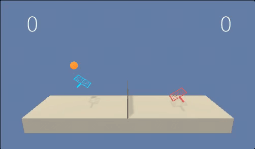

# Project 3:
This is my solution for Project 3 - Collab of Udacity's Deep Reinforcement Learning nanodegree.

### Project Description
The goal is to train to agents to play tennis by letting them compete against each other. This is an episodic task where an agents receive a reward of 0.1 if it manages to hit the ball over the net and a reward of -0.01 if the ball falls to the ground or out of bounds.\
The observation space consists of 8 variables corresponding to the position and velocity of the ball and racket. Each agent receives its own, local observation. Two continuous actions are available, corresponding to movement toward (or away from) the net, and jumping.\
The project can be considered solved, if the average score over 100 episodes exceeds 0.5. The score of an episode is defined as the maximum of the two potentially different scores acheived between the two agents.

### Setup
The setup for this repo is identical to https://github.com/udacity/deep-reinforcement-learning#dependencies so make sure to follow the installation instructions there.\
For training and testing, the environment is expected to be located at `<git root>/Tennis_Linux`

### Training
In order to train the model, adjust the hyperparameters in `agent.py` to your liking, then simply execute
```
python3 train.py
```

### Testing
To test your trained models, you can execute `test.py`. The script expects the folder in which the model files a stored as input. Eg:
``` bash
python3 test.py checkpoint
```

### Result
During the first 600 episodes training progressed only slowly. Then however, the score improved drastically to an average of almost 1.0 at episode ~750. At episode 1056 the average score exceeded 1.0 and training was stopped.

The target score of 0.5 was reached in episode 693.


### Implementation Details
I solved the problem using the Deep Deterministic Policy Gradients (DDPG) algorithm.
See the [report](REPORT.md) for a detailed description of the implementation and design choices.

### Artifacts
Trained models are stored in the checkpoints folder, together with an image of their training progress as seen below.

